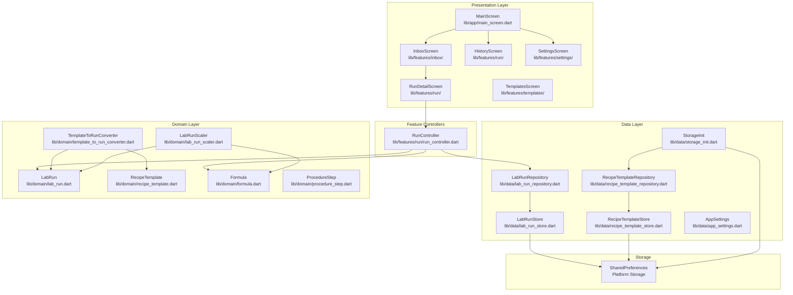
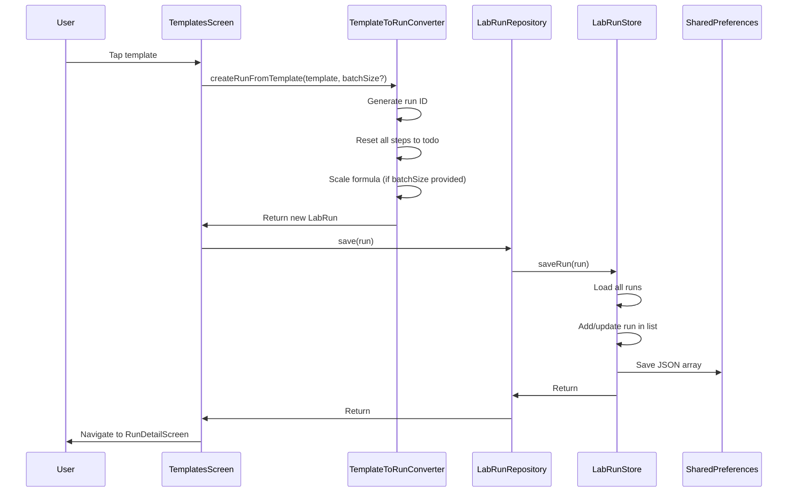
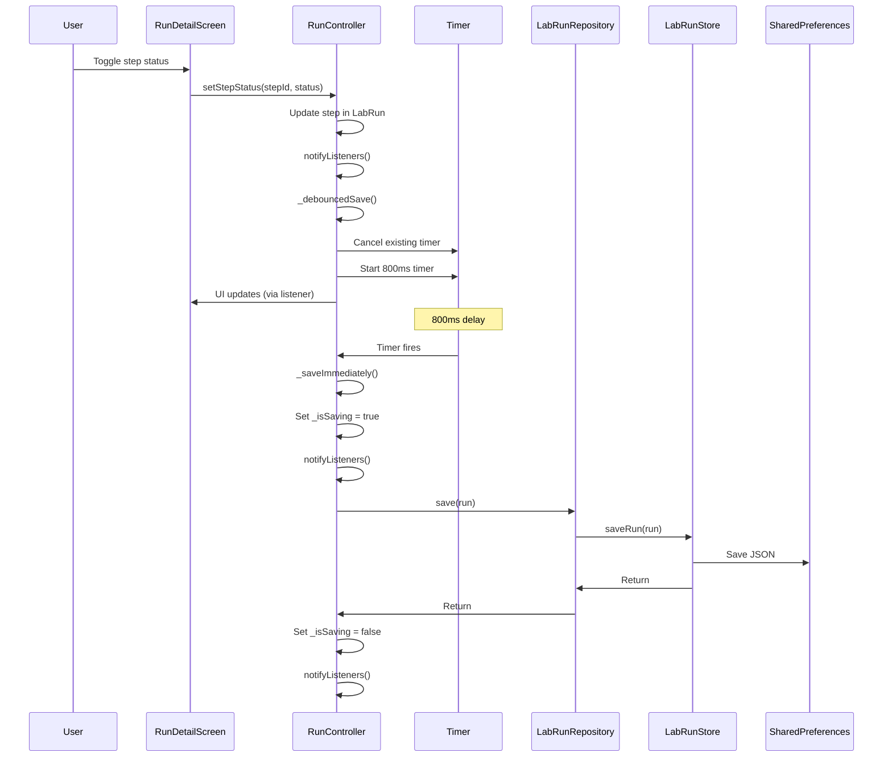
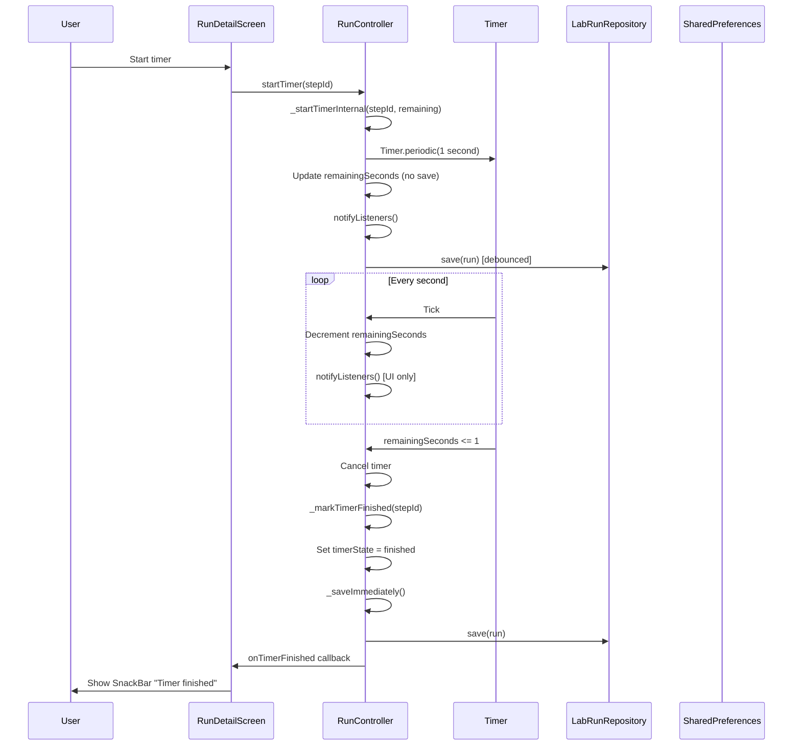

# Architecture

## System Overview

Lab Assistant is a **Flutter mobile/web application** for managing cosmetic lab runs (soap and cream recipes). It follows a **clean architecture** pattern with clear separation between domain, data, and presentation layers. The app is **fully client-side** with no backend API—all data is stored locally using SharedPreferences.



## Runtime Components & Responsibilities

### Entry Point
- **File:** `lib/main.dart`
- **Responsibility:** 
  - Initializes Flutter bindings
  - Initializes storage via `StorageInit.initialize()`
  - Creates `MainApp` widget with theme and Lab Mode support
  - Sets up `MainScreen` as home

### Main Application (`MainApp`)
- **File:** `lib/main.dart` (class `MainApp`)
- **Responsibility:**
  - Manages global app state (Lab Mode enabled/disabled)
  - Applies text scale factor when Lab Mode is enabled (1.15x)
  - Provides MaterialApp with theme and routing

### Main Screen
- **File:** `lib/app/main_screen.dart`
- **Responsibility:**
  - Bottom navigation bar with 3 tabs: Inbox, History, Settings
  - Responsive layout: master/detail for tablets (≥900dp width), regular navigation for phones
  - Routes to feature screens

## Module Map

### App Layer (`lib/app/`)
Core application infrastructure:
- **`app_theme.dart`** - Material Design theme configuration
- **`log.dart`** - Debug logging utility (only logs in debug mode)
- **`main_screen.dart`** - Root navigation screen with bottom nav
- **`ui_tokens.dart`** - Design tokens (spacing, border radius, etc.)
- **`widgets/`** - Reusable UI components:
  - `app_card.dart` - Card widget
  - `primary_button.dart` - Primary action button
  - `secondary_button.dart` - Secondary action button
  - `section_header.dart` - Section header widget

### Domain Layer (`lib/domain/`)
Pure business logic, no dependencies on Flutter or I/O:
- **`lab_run.dart`** - Core entity: a lab run instance with steps, formula, and progress
- **`recipe_template.dart`** - Template for creating lab runs
- **`formula.dart`** - Unified formula model (soap-style and cream-style)
- **`soap_formula.dart`** - Soap-specific formula types (SoapOil, SoapLye, SoapWater)
- **`formula_phase.dart`** - Cream formula phase structure
- **`formula_item.dart`** - Individual ingredient/item in a phase
- **`procedure_step.dart`** - Step in a lab run procedure (instruction, checklist, timer, etc.)
- **`recipe_ref.dart`** - Reference to a recipe (used in LabRun)
- **`recipe_kind.dart`** - Enum: `soap`, `cream`
- **`step_kind.dart`** - Enum: `instruction`, `checklist`, `timer`, `inputNumber`, `note`, `section`
- **`step_status.dart`** - Enum: `todo`, `doing`, `done`, `skipped`
- **`checklist_item.dart`** - Item in a checklist step
- **`template_to_run_converter.dart`** - Converts RecipeTemplate → LabRun
- **`lab_run_to_template_converter.dart`** - Converts LabRun → RecipeTemplate
- **`lab_run_scaler.dart`** - Pure functions for scaling formulas (soap oils, cream phases)
- **`lab_run_validator.dart`** - Validation logic for lab runs
- **`lab_run_parser.dart`** - Parsing logic (if any)
- **`ingredient_section_helper.dart`** - Helper for ingredient section navigation

### Data Layer (`lib/data/`)
Repository pattern wrapping storage:
- **`lab_run_repository.dart`** - Repository for LabRun CRUD operations
- **`lab_run_store.dart`** - Low-level storage using SharedPreferences (key: `lab_runs_v1`)
- **`recipe_template_repository.dart`** - Repository for RecipeTemplate CRUD
- **`recipe_template_store.dart`** - Low-level storage (key: `recipe_templates_v1`)
- **`app_settings.dart`** - App settings (Lab Mode, auto-return) via SharedPreferences
- **`storage_init.dart`** - Storage initialization and version management
- **`data_version.dart`** - Data version constant (currently `1`)
- **`seed_data.dart`** - System template seed data (soap and cream templates)

### Features Layer (`lib/features/`)
Feature-based UI screens and controllers:
- **`inbox/`**
  - `inbox_screen.dart` - List of active (non-archived) runs
  - `inbox_master_detail_screen.dart` - Tablet master/detail layout
- **`run/`**
  - `run_detail_screen.dart` - Main run execution screen (steps + ingredients tabs)
  - `run_controller.dart` - State management for a single run (ChangeNotifier)
  - `history_screen.dart` - List of archived runs
  - `widgets/` - Step-specific widgets:
    - `instruction_step_widget.dart`
    - `checklist_step_widget.dart`
    - `timer_step_widget.dart`
    - `input_number_step_widget.dart`
    - `note_step_widget.dart`
    - `section_step_widget.dart`
    - `ingredients_view.dart` - Ingredients tab view
- **`settings/`**
  - `settings_screen.dart` - App settings UI
  - `components/` - Settings components
- **`templates/`**
  - `templates_screen.dart` - List of recipe templates

### Utils (`lib/utils/`)
- **`date_formatter.dart`** - Date formatting utilities
- **`decimal_input_formatter.dart`** - Text input formatter for decimal numbers

### Widgets (`lib/widgets/`)
- **`recipe_badge.dart`** - Badge showing recipe kind (SOAP/CREAM)

## Layering Rules

### Dependency Direction
```
Presentation (features) → Data (repositories) → Domain
```

- **Features** depend on **Data** (repositories) and **Domain** (models)
- **Data** depends only on **Domain** (no Flutter dependencies in stores)
- **Domain** has **zero dependencies** (pure Dart, no Flutter, no I/O)

### Violations
- ✅ No violations found—clean separation maintained

## Cross-Cutting Concerns

### Logging
- **File:** `lib/app/log.dart`
- **Pattern:** Debug-only logging via `Log.d(tag, message)`
- **Usage:** Only logs in `kDebugMode` (release builds have no logging overhead)

### Configuration
- **File:** `lib/data/app_settings.dart`
- **Storage:** SharedPreferences
- **Settings:**
  - `lab_mode_enabled` - Enables larger text (1.15x scale)
  - `auto_return_enabled` - Auto-return to steps when ingredient section completes (default: true)

### Error Handling
- **Pattern:** Try-catch in storage operations, returns empty lists on parse errors
- **User Feedback:** SnackBars for user actions (delete, archive, export)
- **No global error handler** - Errors handled at widget level

### Validation
- **File:** `lib/domain/lab_run_validator.dart`
- **Usage:** Domain-level validation (if implemented)

### State Management
- **Pattern:** ChangeNotifier for run state (`RunController`)
- **File:** `lib/features/run/run_controller.dart`
- **Responsibilities:**
  - Owns `LabRun` instance
  - Handles all mutations (checklist toggles, input values, status changes)
  - Debounced saves (800ms delay) to avoid excessive I/O
  - Timer management (restores running timers on app restart)
  - Ingredient check state management
  - Auto-completion of steps when ingredient sections complete

### Storage Versioning
- **File:** `lib/data/storage_init.dart`, `lib/data/data_version.dart`
- **Current Version:** `1`
- **Behavior:**
  - On first run: seeds system templates
  - On version mismatch: preserves data, updates version (migration logic TODO)
  - Ensures system templates exist on every startup

## Key Sequences

### Creating a Lab Run from Template



### Updating Step Status (with Debounced Save)



### Timer Step Lifecycle



## Integration Points

### External APIs
- **None** - Fully offline application

### Storage
- **Technology:** SharedPreferences (Flutter plugin: `shared_preferences`)
- **Keys:**
  - `lab_runs_v1` - JSON array of LabRun objects
  - `recipe_templates_v1` - JSON array of RecipeTemplate objects
  - `data_version` - Integer version number
  - `lab_mode_enabled` - Boolean
  - `auto_return_enabled` - Boolean

### Platform Integration
- **Clipboard:** Used for exporting runs (copy JSON to clipboard)
- **File:** `lib/features/inbox/inbox_screen.dart` (line 272)

## Security & Tenancy

- **Authentication:** None (local-only app)
- **Authorization:** None
- **Tenancy:** None (single-user device)
- **Data Encryption:** None (stored in plain JSON via SharedPreferences)

## Risks & Tech Debt

### Known Issues
1. **Storage Migration:** `StorageInit` has TODO for proper migration logic when `DATA_VERSION` changes (currently just preserves data)
   - **File:** `lib/data/storage_init.dart` (line 55)
2. **No Backend Sync:** All data is local-only; no cloud backup or sync
3. **No Data Export/Import:** Only clipboard export for runs (no file-based import/export)
4. **Timer Persistence:** Running timers are restored on app restart, but if app is killed, timer state may be lost (depends on OS)

### Architecture Decisions
- ✅ **Clean Architecture:** Good separation of concerns
- ✅ **Repository Pattern:** Abstraction allows future storage swap
- ✅ **Debounced Saves:** Prevents excessive I/O during rapid user actions
- ✅ **ChangeNotifier:** Simple state management without external dependencies
